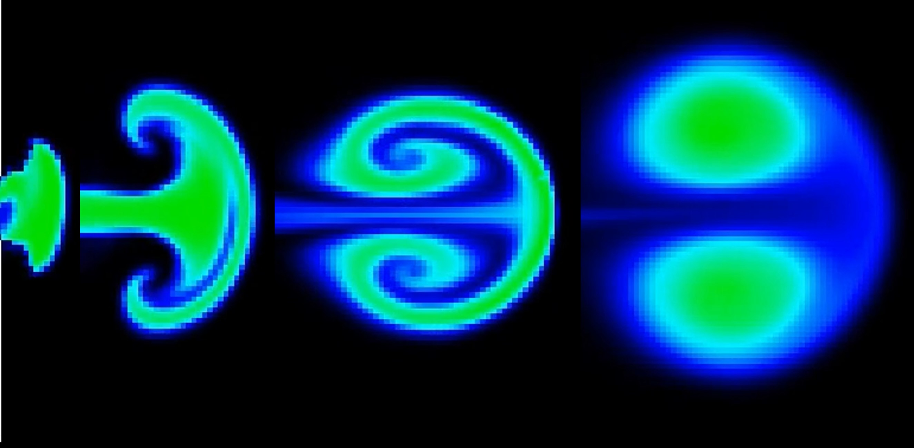

# Navier-Stokes Fluid Simulation 

A robust C++ implementation of incompressible fluid dynamics using the Navier-Stokes equations with support for solid obstacles and real-time interaction. Created to study the behavior of ring vortices.

### Core Components

1. **Grid** (`Grid.h/cpp`)
   - 2D container for fluid properties
   - Efficient row-major storage
   - Bounds checking and utility methods
   - Drawing primitives for obstacles

2. **FluidSolver** (`FluidSolver.h/cpp`)
   - Core Navier-Stokes solver
   - Implements operator splitting method:
     - Advection (semi-Lagrangian)
     - Diffusion (implicit Gauss-Seidel)
     - Projection (Helmholtz decomposition)
   - Solid boundary handling
   - Vorticity computation

3. **Renderer** (`Renderer.h/cpp`)
   - Visualization layer (SFML-based)
   - Multiple color mapping modes
   - Gradient and solid color visualization
   - Screen-grid coordinate conversion

4. **Simulation** (`Simulation.h/cpp`)
   - Main orchestrator
   - Event handling and user interaction
   - Mouse-based fluid manipulation
   - Keyboard shortcuts for visualization modes

5. **Config** (`Config.h`)
   - Centralized configuration constants
   - Physical parameters
   - Visualization settings
   - Interaction defaults


## Building the Project

### Requirements
- C++17 or later
- SFML 2.5+
- CMake (optional, for build system)

### Compilation
```bash
g++ -std=c++17 -o fluid_sim \
    core/main.cpp \
    core/Grid.cpp \
    core/FluidSolver.cpp \
    core/Renderer.cpp \
    core/Simulation.cpp \
    -I core \
    -lsfml-graphics -lsfml-window -lsfml-system
```

## Usage

### Basic Example
```cpp
#include "Simulation.h"

int main() {
    // Create 100x100 grid with 4x screen scaling
    navier::Simulation sim(100, 100, 4.0f);
    
    // Configure physics
    sim.setPhysicalParameters(1.0f, 1.0f, 0.005f);
    
    // Add obstacles
    sim.addObstacles({
        navier::Line(40, 40, 20, true, 2)
    });
    
    // Run simulation
    sim.run();
    
    return 0;
}
```

### Interactive Controls
- **Mouse**: Click and drag to add scalar/velocity/pressure
- **0**: View scalar field (dye)
- **1**: View horizontal velocity (u)
- **2**: View vertical velocity (v)
- **3**: View pressure field
- **4**: View vorticity (curl)
- **+/-**: Increase/decrease brush radius
- **G**: Toggle gradient visualization
- **N**: Toggle value normalization

## Advanced Features

### Periodic Forcing
```cpp
sim.setPeriodicForcing(
    [](Grid& u, double t, double dt) {
        // Add time-varying forces
        u(50, 50) += std::sin(t) * 100.0f;
    },
    nullptr, nullptr, nullptr
);
```

### Custom Boundaries
```cpp
sim.setBoundaryConditions(
    BoundaryType::HORIZONTAL,  // Reflect horizontal velocity at walls
    BoundaryType::VERTICAL,    // Reflect vertical velocity at walls
    BoundaryType::NONE,        // Free-slip for scalar
    BoundaryType::NONE         // Free-slip for pressure
);
```

### Visualization Configuration
```cpp
ColorMap map;
map.r = 1.0f; map.g = 0.0f; map.b = 0.0f;
map.useGradient = false;
map.normalize = true;
sim.setColorMap(map);
```

## Physical Model

The solver implements the incompressible Navier-Stokes equations:

```
∂u/∂t + (u·∇)u = -∇p + ν∇²u + f
∇·u = 0
```

Where:
- **u**: velocity field
- **p**: pressure field
- **ν**: kinematic viscosity
- **f**: external forces

### Numerical Method
1. **Advection**: Semi-Lagrangian backtrace with bilinear interpolation
2. **Diffusion**: Implicit solver using Gauss-Seidel iteration
3. **Projection**: Helmholtz decomposition to enforce incompressibility
4. **Solid Boundaries**: No-slip/free-slip conditions at obstacles

## Solver Theory

### Introduction

Ring vortices are toroidal structures that form when fluid is impulsively ejected through an opening. The vorticity at the boundary rolls up due to velocity gradients, creating a self-propagating vortex ring. This project studies ring vortices through 2D fluid simulations.

### Computational Method

The simulation solves the incompressible Navier-Stokes equations using operator splitting. For the velocity field:

$$\frac{\partial \mathbf{u}}{\partial t} = -(\mathbf{u}\cdot\nabla)\mathbf{u} - \frac{1}{\rho}\nabla p + \nu \nabla^2\mathbf{u} + \mathbf{f}$$

and for scalar fields (e.g., dye density):

$$\frac{\partial s}{\partial t} = -(\mathbf{u}\cdot\nabla)s + \kappa \nabla^2 s + S$$

The implementation uses an **Eulerian** approach with finite differences on a **MAC (Marker and Cell)** grid structure, where scalars are stored at cell centers and velocity components at cell faces.

Each time step applies a sequence of operators:

$$\mathbf{u}^{n+1} = \mathbf{P} \circ \mathbf{F} \circ \mathbf{D} \circ \mathbf{A}(\mathbf{u}^n)$$

Where:
- **A (Advection)**: Semi-Lagrangian backward trace with interpolation
- **D (Diffusion)**: Implicit solver using Gauss-Seidel relaxation
- **F (Forces)**: Addition of external forces
- **P (Projection)**: Helmholtz-Hodge decomposition to enforce incompressibility

The projection step solves the Poisson equation:

$$\nabla^2 p = \nabla \cdot \mathbf{u}$$

to obtain the pressure field that makes the velocity divergence-free.

## Ring Vortex Results

### Theoretical Background

Classical theory for ring vortices provides the propagation velocity:

$$U = \frac{\pi\omega_0 a^2}{4\pi R} \left(\ln\frac{8R}{a} - \frac{1}{4}\right)$$

where $a$ is the characteristic vortex core radius, $R$ is the toroidal radius, and $\omega_0$ is the vorticity. This model assumes uniform vorticity and $a \ll R$. Our 2D simulations deviate from this regime as these approximations are not met.

### Empirical Relationships

The most important quantity studied is the **ring propagation velocity**, which exhibits strong correlations with other physical parameters:

#### 1. Velocity vs. Energy

Approximately **linear relationship**:
$$U \propto E_0$$

where $U$ is the translation velocity and $E_0$ is the initial energy input.

#### 2. Velocity vs. Mean Radius

Approximately **linear relationship**:
$$U \propto r_{\text{mean}}$$

where $r_{\text{mean}} = (a+b)/2$ is the mean radius of the vortex cross-section (with inner radius $a$ and outer radius $b$).

These linear relationships indicate that velocity, energy, and radius are closely interconnected. If we assume $R = k \cdot a$, the theoretical formula becomes:

$$U = \frac{\pi\omega_0 a}{4\pi k}\left(\ln(8k) - \frac{1}{4}\right)$$

which is indeed linear with $a$, though this remains conjectural.

#### 3. Velocity vs. Vorticity

The relationship shows approximately:
$$U \propto \sqrt{\omega}$$

where $\omega$ is the vorticity.

### Conclusion

While results do not conform to the simplified theoretical model, this is expected as our 2D system does not satisfy the approximations ($a \ll R$, uniform vorticity) assumed by that model. The observed relationships reveal more complex behavior than the idealized case.

## Project Structure

```
navier-stokes-main/
├── core/
│   ├── Config.h          # Configuration constants
│   ├── Grid.h/cpp        # 2D grid container
│   ├── FluidSolver.h/cpp # Navier-Stokes solver
│   ├── Renderer.h/cpp    # Visualization layer
│   ├── Simulation.h/cpp  # Main simulation controller
│   └── main.cpp          # Example application
├── images/
│   └── timeline.jpg      # Simulation timeline image
├── CMakeLists.txt        # Build configuration
└── README.md             # This file
```

## Performance Considerations

- **Grid Size**: 100x100 typical, can handle up to 500x500 on modern hardware
- **Time Step**: Automatically clamped for stability (0.001-0.1)
- **Iterations**: 20 Gauss-Seidel iterations per solve (configurable)
- **FPS**: Default 60, adjustable based on performance needs

## License

MIT License


